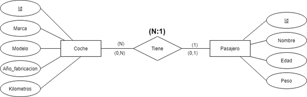
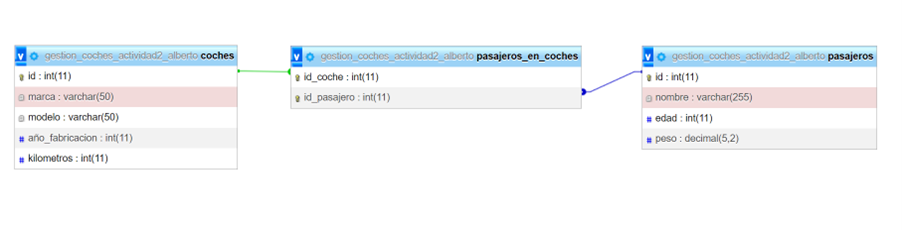
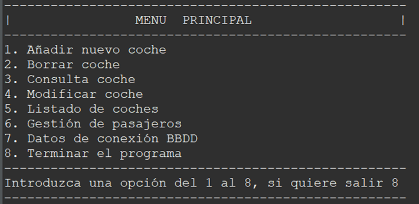
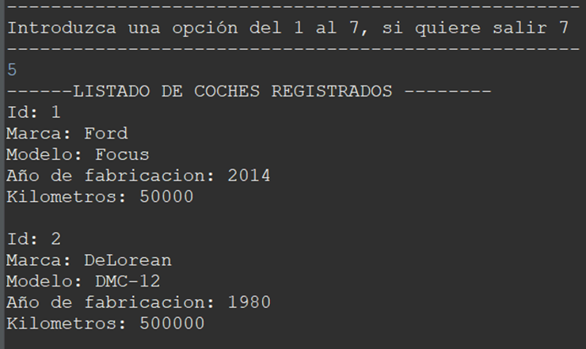
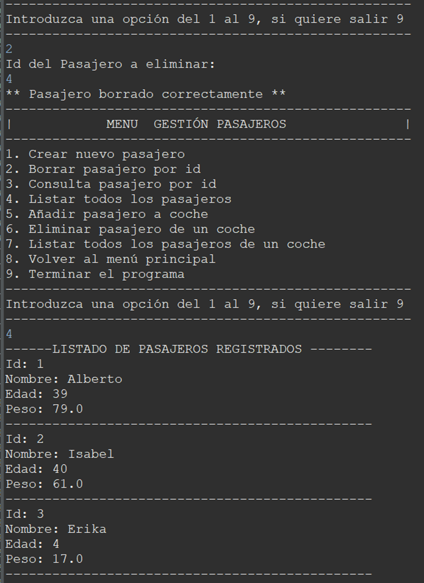
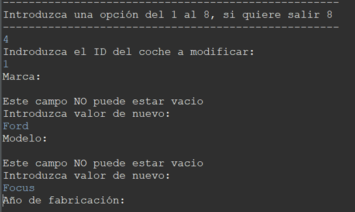
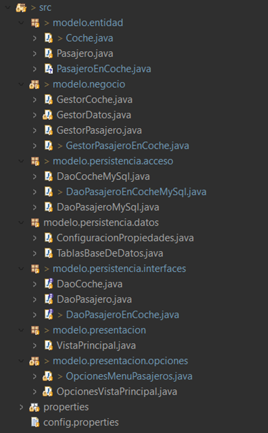

# Acceso a Datos

## Actividad 2 – Manejo de conectores de BBDD (JDBC)

Actividad Realizada por:

###  Alberto Arroyo Santofimia

https://github.com/AlbertoArroyoS/Actividad2BBDD

# Objetivos

Aprender a manejar JDBC mediante una pequeña aplicación de gestión de coches

Pautas de elaboración

### Requerimiento 1

Se desea hacer un CRUD completo de la entidad ‘Coche’, pero esta vez no se trabajará con ningún fichero, se trabajará con una BBDD. Es muy importante usar el patrón DAO visto en clase. Los parámetros de conexión a la BBDD deben estar hechos en un fichero de propiedades.

El coche tendrá los siguientes atributos: id, marca, modelo, año de fabricación y km.

El menú mostrado será de la siguiente forma:

Añadir nuevo coche (El ID lo incrementará automáticamente la base de datos)
Borrar coche por ID
Consulta coche por ID
Modificar coche por ID (pedirá todos los valores y modificará dichos valores a partir del ID del coche)
Listado de coches
Terminar el programa

### Requerimiento 2

Se pide añadir la siguiente funcionalidad.

Los coches, tendrán asociados N pasajeros en él (habrá que crear la tabla pasajeros y hacer la relación pertinente). Los pasajeros tendrán los siguientes atributos, id, nombre, edad y peso. Se añadirá la opción “gestión de pasajeros” al programa principal, dicha opción nos mostrará un submenú como el que sigue

Crear nuevo pasajero
Borrar pasajero por id
Consulta pasajero por id
Listar todos los pasajeros
Añadir pasajero a coche, el programa nos pedirá un id de un pasajero y el id de un coche, y lo añadirá al coche a nivel de base de datos. Sería una buena opción mostrar todos los coches disponibles.
Eliminar pasajero de un coche, el programa nos pedirá un id de un pasajero y lo eliminará del coche a nivel de base de datos. Sería una buena opción mostrar todos los coches y sus pasajeros asociados.
Listar todos los pasajeros de un coche, el programa pedirá el id de un coche, y nos mostrará todos los pasajeros asociados a él.

### Requerimiento 3

La aplicación no debe permitir que la marca y el modelo estén vacíos. Esta parte la debe de gestionar la capa gestora 

y seguir el modelo de tres capas visto en clase.

